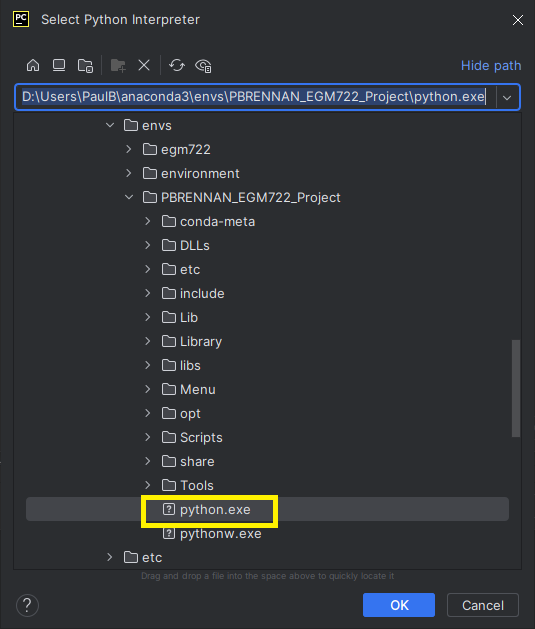

## 1.0 Setup / installation. 

The files for the project are hosted on a public GitHub repository which can be accessed at:

<https://github.com/paulbrennan863/PBRENNAN_EGM722_Project>

You can either:

1) Clone the repository using the following command in Windows Command Prompt:

```console
git clone https://github.com/paulbrennan863/PBRENNAN_EGM722_Project.git
```

2) Alternatively download the files manually from the GitHub repository as a ZIP file.

**IMPORTANT:** If downloading manually, ensure the ‘Datafiles’ folder and its contents remain in the same directory as the ‘PBRENNAN_EGM722_V3.py’ script file.

To replicate the project environment and install all dependencies, a **Conda environment file(**environment.yml**)** is included as (**Figure 1**.)


***Figure 1.** Project environment.yml file*

To set up the environment in Windows Command Prompt, run:

```console
conda env create -f environment.yml</span>*
```

Once the environment is created, activate it using the command:

```console
conda activate \<environment_name\></span>*
```

(Replace \<environment_name\> with the actual name of the environment you created)

To confirm all libraries and dependencies files have been installed run the following command:

```console
conda list</span>*
```

This will display a list of the installed packages within the Conda environment and their version numbers. Ensure that the libraries in **(Figure 1.)** are shown. If any libraries are missing they can be installed through the Anaconda App or through PIP.

## 1.1 Test and data files.

There are several Input test and GIS data files included in the project. Details of these and their source is provided in **Table 1 & 2.**

**Table 1. Input Test data files.**

| **Name of file** | **Description** | **Source** |
|:---|:---|:---|
| AEMP_TESTFILE_1.xml | Test xml file which was downloaded from the company’s telematic system. Note machine details have been changed for data protection and commercial reasons | Author’s company telematic portal |
| TestAEMP_corrupted.xml | This a corrupted version of the xml used for testing the error catching features of the software | Author’s company telematic portal |

**Table 2. Input GIS datasets.**

| **Name of file** | **Description** | **Source** |
|:---|:---|:---|
| NI_250k_bedrock_RCS_D_clipped.shp | This is the 250K Geological Service of Northern Ireland vector map of the main bedrock types withing Norther Ireland. The original fie has been clipped with ArcGIS pro to give a cleaner outline of Northern Ireland | https://admin.opendatani.gov.uk/dataset/gsni-250k-geology |
| ni_dtm.tif | This is the 50 metre Digital Terrain Model height file for Northern Ireland. (the version used was supplied on course module EGM711) | https://www.nidirect.gov.uk/articles/50m-digital-terrain-model-height-data |

## 1.2 Running the code.

The project script can be run from either within the PyCharm Integrated Development Environment (IDE) or through the Command Line Interface (CLI). A project file can be created within the same directory that the files were downloaded too.

In the the PyCharm IDE window ensure the interpreter is set to the projects Conda environment by clicking the Interpreter settings in bottom right hand side of the IDE as highlighted in (**Figure 2.)** and makes sure the interpreter is set to the Python.exe file within the environment (**Figure 3.)** Note the project and environment names will be the same as the ones created above.

Once setup the Python script can be run and debugged as normal in PyCharm.


***Figure 2.** PyCharm Interpreter selection ribbon.*



***Figure 3. PyCharm** Interpreter selection path set to Conda environment.*

To run the project through the command line interface, the Conda environment that has been created will need to be activated. This can be undertaken through the Anaconda.Navigator application software by starting the "project environment" and then starting the command prompt in the application (**Figure 4.)**


***Figure 4.** Launch the Command Line Interface through the Anaconda.Navigator application*

To start the program directly with the CLI, navigate to the folder where the project code has been downloaded or cloned from the GitHub repository. Ensure the Conda environment is activated. The name will be in brackets and should look like something (**Figure 5.)**


***Figure 5.** Ensure the CLI is running the appropriate Conda environment and changed to the project directory*

To start the python script type the following command (**Figure 6**.) Further details of the application operation are provided in section 3.0.

```console
python PBRENNAN_EGM722_V3.py
```


***Figure 6.** Command to start the project python script*
